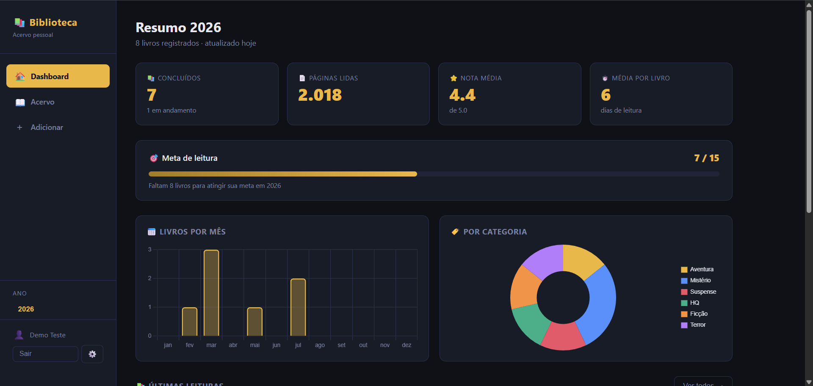

# 📚 Biblioteca Digital

Sistema pessoal de gerenciamento de acervo literário desenvolvido para substituir uma planilha Excel por uma aplicação web completa com banco de dados persistente.

## 🖥️ Demonstração



## 💡 Motivação

Eu tinha meu acervo de leituras registrado em uma planilha Excel. Com o tempo percebi que precisava de algo mais robusto — acessível de qualquer dispositivo, com histórico preservado e interface agradável. Esse projeto nasceu dessa necessidade real.

## ✨ Funcionalidades

- 📊 **Dashboard** com estatísticas do ano (livros concluídos, páginas lidas, nota média, média de dias por livro)
- 🎯 **Meta de leitura** anual com barra de progresso
- 📅 **Gráficos** de livros por mês e por categoria
- 📖 **Acervo completo** com filtros por ano, categoria e status
- ➕ **CRUD completo** — adicionar, editar e remover livros
- ⭐ **Avaliação** por estrelas (0 a 5, com meias estrelas)
- 📱 **Responsivo** — funciona em desktop e mobile
- 🗂️ **Gerenciamento de anos** com metas opcionais

## 🛠️ Tecnologias

| Camada         | Tecnologia                 |
| -------------- | -------------------------- |
| Frontend       | HTML, CSS, JavaScript puro |
| Backend        | Node.js + Express          |
| Banco de dados | SQLite (better-sqlite3)    |
| Servidor       | Ubuntu Server 24.04 LTS    |
| Versionamento  | Git + GitHub               |

## 🏗️ Arquitetura

```
Cliente (navegador/mobile)
        ↓
Ubuntu Server 24.04
        ↓
Node.js + Express
        ↓
SQLite (biblioteca.db)
```

## 🚀 Como rodar localmente

**Pré-requisitos:** Node.js 20+

```bash
# Clone o repositório
git clone https://github.com/vitorrcruzz/biblioteca-digital.git
cd biblioteca-digital

# Instale as dependências
npm install

# Inicie o servidor
npm start
```

Acesse `http://localhost:3000`

## 📁 Estrutura do projeto

```
biblioteca-digital/
├── public/                  # Frontend estático
│   ├── index.html
│   ├── assets/
│   │   ├── css/style.css
│   │   └── js/script.js
│   └── images/
├── server/                  # Backend
│   ├── index.js             # Servidor Express
│   ├── database.js          # Conexão SQLite
│   ├── migrate.js           # Script de migração do Excel
│   └── routes/
│       ├── books.js         # API REST de livros
│       └── goals.js         # API REST de metas
└── package.json
```

## 📊 Dados

O sistema foi migrado de uma planilha Excel com registros desde 2022. O script `server/migrate.js` realizou a importação automática de todos os livros para o banco SQLite.

## 🔄 Próximos passos

- [ ] Cloudflare Tunnel para acesso externo seguro
- [ ] Backup automático
- [ ] Autenticação com login e senha

## 👨‍💻 Autor

**Vitor** — Desenvolvido como projeto pessoal para aprendizado e uso diário.

[](https://www.linkedin.com/in/vitor-cruz-5214b91bb)
